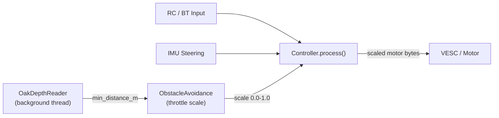
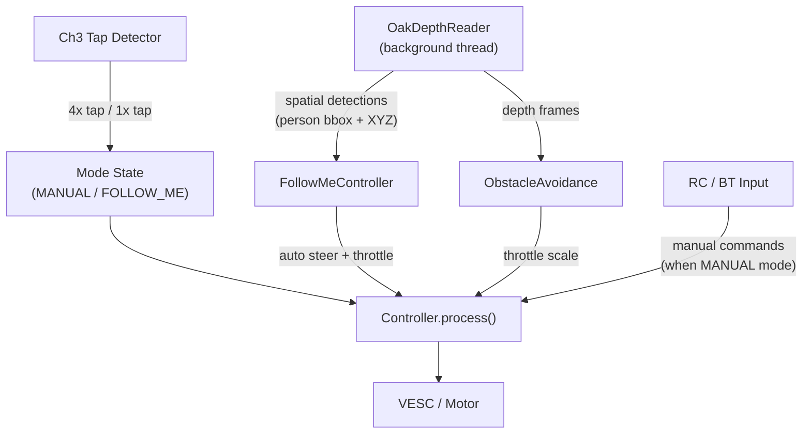

# OAK-D Lite Integration: Obstacle Avoidance + Follow Me

Integrate an OAK-D Lite stereo depth camera into Wall-E Mini for (1) forward obstacle avoidance with graduated throttle reduction, and (2) a Follow Me mode that uses on-device person detection to autonomously track and follow a person.

---

## Part 1: Obstacle Avoidance

### Behavior

- **Beyond `slow_distance_m`**: Full speed, no intervention
- **Between `slow_distance_m` and `stop_distance_m`**: Linear throttle reduction (1.0 down to 0.0)
- **Below `stop_distance_m`**: Hard stop, motors forced to neutral
- Steering direction is preserved — only speed magnitude is scaled
- No operator override — safety is enforced regardless of RC/BT input

### Architecture



The depth reader runs on a background thread (same pattern as `ArduinoRCReader`), and the controller polls the latest reading each tick. This avoids the latency of file-based IPC and keeps obstacle data fresh.

### New Files

#### 1. Hardware: `pi_app/hardware/oak_depth.py`

Threaded depth reader wrapping the DepthAI stereo depth pipeline.

- Configures OAK-D Lite stereo pair with a center ROI (forward-facing zone)
- Background thread pulls depth frames and computes the minimum distance (meters) within the ROI
- Thread-safe `get_min_distance()` returns `(distance_m, age_s)` — the latest reading and how stale it is
- `detect()` static method checks if an OAK-D Lite is connected (for graceful fallback)
- Follows the existing pattern in `pi_app/hardware/arduino_rc.py`: background daemon thread, lock-protected state, `start()`/`stop()` lifecycle

#### 2. Control: `pi_app/control/obstacle_avoidance.py`

Pure logic module that computes throttle scaling from distance.

- `ObstacleAvoidanceController` class
- `compute_throttle_scale(distance_m) -> float`: returns 1.0 (full speed) to 0.0 (stop) based on configured thresholds
- Handles stale data: if depth reading is older than a configurable timeout, treats it as "no data" (configurable: either assume clear, or assume blocked for safety)
- Exposes status dict for telemetry logging

#### 3. Config additions in `config.py`

New `ObstacleAvoidanceConfig` dataclass:

```python
@dataclass(frozen=True)
class ObstacleAvoidanceConfig:
    enabled: bool = True
    slow_distance_m: float = 1.5      # Start reducing speed
    stop_distance_m: float = 0.4      # Hard stop
    roi_width_pct: float = 0.5        # Center 50% of frame width
    roi_height_pct: float = 0.5       # Center 50% of frame height
    update_rate_hz: float = 15.0      # Depth polling rate
    stale_timeout_s: float = 0.5      # Max age before reading is stale
    stale_policy: str = "stop"        # "stop" or "clear" when data is stale
```

Added as `obstacle_avoidance: ObstacleAvoidanceConfig` field on the existing `Config` class.

### Modifications to Existing Files

#### 4. Controller: `pi_app/control/controller.py`

- Accept an optional `ObstacleAvoidanceController` in `__init__`
- After computing final `left`/`right` motor bytes (post-IMU correction, pre-arming check), apply throttle scaling:

```python
if self._obstacle_avoidance is not None:
    scale = self._obstacle_avoidance.compute_throttle_scale(distance_m)
    left = self._scale_toward_neutral(left, scale)
    right = self._scale_toward_neutral(right, scale)
```

Where `_scale_toward_neutral(byte_val, scale)` interpolates between the commanded value and neutral (126). At scale=1.0 the value is unchanged; at scale=0.0 it becomes 126 (stopped).

- Add obstacle fields to telemetry dict (`obstacle_distance_m`, `obstacle_throttle_scale`)

#### 5. Main: `pi_app/app/main.py`

- Import and initialize `OakDepthReader` and `ObstacleAvoidanceController` (gated on `config.obstacle_avoidance.enabled`)
- Graceful fallback if camera not detected (like the existing IMU pattern)
- Pass obstacle controller to `Controller`
- Add obstacle data to console display and structured JSON logs
- Call `oak_reader.stop()` in the `finally` cleanup block

#### 6. Dependencies: `requirements.txt`

- Add `depthai>=2.24` (the DepthAI SDK for OAK cameras)

---

## Part 2: Follow Me Mode

### Behavior

- **Activation**: 4 rapid taps on Channel 3 while armed (arm→disarm cycles within ~2 seconds) enters Follow Me mode
- **Deactivation**: A single Channel 3 disarm tap exits Follow Me AND disarms the robot
- When active, the robot autonomously follows the person nearest the center of the frame and closest in depth
- **Speed**: Proportional to distance — faster when far from target distance, decelerates as it approaches, stops at target follow distance
- **Steering**: Proportional to the person's horizontal offset from frame center — further off-center means harder turn
- **Lost target**: Stop immediately and wait (motors to neutral, hold position until person reappears)
- **Obstacle avoidance remains active** on top of Follow Me — if an obstacle appears between the robot and the person, the throttle scale still applies

### Architecture



### Person Detection: OAK-D Lite Spatial Detection

The OAK-D Lite's Myriad X VPU runs MobileNet-SSD person detection fused with stereo depth — this is DepthAI's `MobileNetSpatialDetectionNetwork` node. It outputs bounding boxes with 3D coordinates (X, Y, Z in meters) at ~30fps with zero Pi CPU cost.

**Target selection logic** (in `FollowMeController`):

1. Filter detections to `label == "person"` with confidence above threshold
2. Score each detection: `score = w1 * center_closeness + w2 * depth_closeness` (prefer person nearest frame center AND closest in depth)
3. Select the highest-scoring detection as the target

### New Files

#### 7. Control: `pi_app/control/follow_me.py`

Person-following controller with proportional steering and speed.

- `FollowMeController` class
- **Input**: list of spatial detections from OAK-D Lite (bounding box + XYZ per person)
- **Target selection**: picks the person nearest center and closest in depth (weighted scoring)
- **Steering output**: proportional to `target_x_offset / (frame_width / 2)`, normalized to [-1.0, 1.0], converted to differential motor bytes (left/right)
- **Speed output**: proportional to `(target_distance - follow_distance_m)`, clamped to [0, max_follow_speed_byte]
- **Lost target**: returns neutral commands (126, 126) immediately when no valid person detection
- `get_status()` returns tracking state for telemetry (target distance, offset, tracking/lost)

#### 8. Safety: Ch3 Tap Detector (modification to `safety.py`)

Add tap-counting state to `SafetyState` and detection logic to `update_safety()`:

- Track Ch3 arm/disarm transitions with timestamps
- A "tap" = one arm→disarm cycle (Ch3 goes high then low)
- If 4 taps occur within `tap_window_s` (default 2.0s) while starting from armed state: emit `SafetyEvent.FOLLOW_ME_ENTERED`
- Any single disarm while in Follow Me mode: emit `SafetyEvent.FOLLOW_ME_EXITED` and `SafetyEvent.DISARMED`
- Tap counter resets if window expires without reaching 4

### Config Additions

Extended `config.py` with `FollowMeConfig`:

```python
@dataclass(frozen=True)
class FollowMeConfig:
    enabled: bool = True
    follow_distance_m: float = 1.5       # Target distance to maintain
    min_distance_m: float = 0.5          # Stop if closer than this
    max_distance_m: float = 5.0          # Ignore detections beyond this
    max_follow_speed_byte: int = 60      # Max speed offset from neutral (126 +/- this)
    steering_gain: float = 0.8           # Proportional gain for horizontal tracking
    detection_confidence: float = 0.5    # Minimum detection confidence
    tap_window_s: float = 2.0            # Time window for 4-tap activation
    tap_count: int = 4                   # Number of taps to activate
```

### Modifications to Existing Files

#### Controller: `controller.py`

- Add mode state: `MANUAL` or `FOLLOW_ME`
- When in `FOLLOW_ME` mode:
  - Ignore RC/BT drive inputs
  - Poll `FollowMeController` for autonomous steering/throttle commands
  - Still apply obstacle avoidance throttle scaling on top
  - Still respect emergency stop (Ch5)
- Mode transitions driven by `SafetyEvent.FOLLOW_ME_ENTERED` / `FOLLOW_ME_EXITED`

#### Main: `main.py`

- Pass spatial detection data from `OakDepthReader` to `FollowMeController` each tick
- Display mode (MANUAL/FOLLOW_ME) and tracking status on console
- Log Follow Me telemetry (target distance, offset, mode) to structured JSON

#### Hardware: `oak_depth.py`

- Extended from Part 1 to also run `MobileNetSpatialDetectionNetwork` on the OAK's VPU
- Exposes two APIs:
  - `get_min_distance()` for obstacle avoidance (unchanged)
  - `get_person_detections()` returns list of `PersonDetection(x_m, y_m, z_m, bbox, confidence)` for Follow Me

---

## System Configuration (Pre-Code)

Before the code can work, the Pi needs one-time setup:

- **USB rules**: Install DepthAI udev rules so the camera is accessible without root: `echo 'SUBSYSTEM=="usb", ATTRS{idVendor}=="03e7", MODE="0666"' | sudo tee /etc/udev/rules.d/80-movidius.rules && sudo udevadm control --reload-rules && sudo udevadm trigger`
- **pip install**: `pip install depthai` in the project venv
- **USB bandwidth**: OAK-D Lite needs USB 3.0; verify the Pi's USB port supports it. On Pi 5 this is fine out of the box.
- **NN blob**: MobileNet-SSD blob for person detection ships with DepthAI (`depthai-model-zoo`) or can be downloaded via `blobconverter`. No manual model conversion needed.

## Testing Strategy

- Unit tests for `ObstacleAvoidanceController.compute_throttle_scale()` (pure math, no hardware)
- Unit tests for `Controller` with a mock obstacle avoidance controller
- Unit tests for Ch3 tap detector (tap sequences, timeouts, edge cases)
- Unit tests for `FollowMeController` target selection and proportional control (mock detections)
- Unit tests for `Controller` mode switching (manual -> follow me -> disarm)
- CLI tool `pi_app/cli/test_oak_depth.py` to verify depth + person detection before integrating into the main loop

## Implementation Order

1. System setup (udev, depthai install)
2. `config.py` — add both config dataclasses
3. `oak_depth.py` — hardware reader (depth + spatial detection)
4. `obstacle_avoidance.py` — throttle scaling logic
5. `safety.py` — Ch3 tap detector
6. `follow_me.py` — person tracking controller
7. `controller.py` — integrate obstacle avoidance, mode switching, follow me
8. `main.py` — wire everything together
9. `requirements.txt` — add depthai
10. `test_oak_depth.py` — CLI verification tool
11. Unit tests
